# THR505 Voice Demo - Technical Architecture Deep Dive

> **Audience:** Level 300 (Advanced) and Level 400 (Expert) Developers & Architects  
> **Last Updated:** February 2026  
> **Version:** 2.0

---

## Table of Contents

1. [Executive Summary](#1-executive-summary)
2. [Solution Architecture Comparison](#2-solution-architecture-comparison)
3. [Authentication & Security Architecture](#3-authentication--security-architecture)
4. [Services & Infrastructure](#4-services--infrastructure)
5. [Troubleshooting Guide](#5-troubleshooting-guide)
6. [Codebase Walkthrough](#6-codebase-walkthrough)
7. [Performance & Scalability](#7-performance--scalability)

---

## 1. Executive Summary

This demo showcases three distinct approaches for integrating voice capabilities with Microsoft Copilot Studio agents:

| Solution | Latency | Complexity | Use Case |
|----------|---------|------------|----------|
| **Direct Line Speech** | ~200-400ms | High | Real-time IVR, Telephony |
| **Direct Line + Ponyfill** | ~400-600ms | Medium | Web apps with optional voice |
| **Direct Line Only** | ~100-200ms | Low | Text-based chatbots |

---

## 2. Solution Architecture Comparison

### 2.1 Direct Line Speech - Unified Channel Architecture

Direct Line Speech (DLS) provides a **single WebSocket connection** that handles both audio streaming and bot messaging through Azure Speech Services.

#### High-Level Architecture Diagram


#### ASCII Flow Diagram (Alternative View)
```
┌─────────────────────────────────────────────────────────────────────────────┐
│                         DIRECT LINE SPEECH FLOW                             │
├─────────────────────────────────────────────────────────────────────────────┤
│                                                                             │
│  ┌──────────┐    WebSocket     ┌─────────────────┐    Bot Framework    ┌──────────────┐
│  │  Browser │◄────────────────►│  Azure Speech   │◄──────────────────►│ Proxy Bot    │
│  │  Client  │   (Single Conn)  │  Services (DLS) │    Direct Line     │ (App Service)│
│  └──────────┘                  └─────────────────┘                    └──────────────┘
│       │                               │                                      │
│       ▼                               ▼                                      ▼
│  ┌──────────┐                  ┌─────────────────┐                   ┌──────────────┐
│  │ Web Chat │                  │ STT / TTS       │                   │ Copilot      │
│  │ + Speech │                  │ Processing      │                   │ Studio       │
│  │ Adapter  │                  │ (Neural Voices) │                   │ Agent        │
│  └──────────┘                  └─────────────────┘                   └──────────────┘
│                                                                             │
│  KEY: Single WebSocket carries BOTH audio streams and bot messages          │
└─────────────────────────────────────────────────────────────────────────────┘
```

#### Detailed Sequence Diagram



```mermaid
sequenceDiagram
    autonumber
    participant User
    participant Browser as Browser<br/>(React + Speech SDK)
    participant Server as Node.js Server<br/>(:3001)
    participant Speech as Azure Speech<br/>Services
    participant DLS as Direct Line<br/>Speech Channel
    participant Bot as Proxy Bot<br/>(App Service)
    participant Copilot as Copilot Studio<br/>Agent

    Note over User, Copilot: Phase 1: Authentication & Connection Setup
    
    Browser->>Server: GET /api/speechservices/token
    Server->>Server: DefaultAzureCredential.getToken()
    Server->>Speech: POST /sts/v1.0/issueToken<br/>Authorization: Bearer {AAD_TOKEN}
    Speech-->>Server: Speech Authorization Token (10 min TTL)
    Server-->>Browser: { token, region, endpoint }
    
    Browser->>Browser: createDirectLineSpeechAdapter({<br/>  authorizationToken,<br/>  region<br/>})
    
    Browser->>DLS: WebSocket: wss://region.convai.speech.microsoft.com
    DLS-->>Browser: WebSocket Connected
    
    Note over User, Copilot: Phase 2: Voice Interaction Flow
    
    User->>Browser: 🎤 Speaks: "What are my benefits?"
    Browser->>Browser: Capture audio from microphone
    
    loop Real-time Audio Streaming
        Browser->>DLS: Binary Frame: Audio Chunk (16kHz PCM)
        DLS->>Speech: Forward to STT Engine
    end
    
    Speech->>Speech: Speech Recognition Processing
    Speech-->>DLS: Recognized Text: "What are my benefits?"
    
    DLS->>Bot: Activity: { type: 'message', text: '...' }
    Bot->>Bot: bot.ts: onMessage()
    Bot->>Copilot: POST /conversations/{id}/activities
    
    Copilot->>Copilot: Topic Matching & Response Generation
    Copilot-->>Bot: Activity: { type: 'message', text: 'Your benefits include...' }
    
    Bot-->>DLS: Forward Activity
    DLS->>Speech: TTS: Convert text to audio
    Speech->>Speech: Neural Voice Synthesis
    Speech-->>DLS: Audio Stream (24kHz Opus)
    
    DLS-->>Browser: Binary Frame: Audio Response
    Browser->>Browser: Play audio through speakers
    Browser->>User: 🔊 "Your benefits include..."
    
    Note over User, Copilot: Phase 3: Barge-in Handling
    
    User->>Browser: 🎤 Interrupts while TTS playing
    Browser->>Browser: Detect voice activity
    Browser->>Browser: speechSynthesis.cancel()
    Browser->>DLS: Start new recognition session
```

#### WebSocket Frame Protocol


#### Key Code Components

```typescript
// client/src/hooks/useDirectLineSpeechConnection.ts
// Creates the unified DLS adapter

import { createDirectLineSpeechAdapters } from 'botframework-directlinespeech-sdk';

const adapters = await createDirectLineSpeechAdapters({
  authorizationToken: token,           // From /api/speechservices/token
  region: 'eastus',
  speechRecognitionLanguage: 'en-US',
  speechSynthesisVoiceName: 'en-US-JennyNeural',
  
  // Advanced options
  speechRecognitionEndpointId: undefined,  // Custom Speech model
  textNormalization: 'display',
  enableTelemetry: false,
});

// Returns: { directLine, webSpeechPonyfillFactory }
// Both use the SAME underlying WebSocket connection
```

```typescript
// proxy-bot/src/bot.ts
// Handles activities from DLS channel

export class ProxyBot extends ActivityHandler {
  private copilotClient: CopilotClient;

  constructor() {
    super();
    this.copilotClient = new CopilotClient();

    this.onMessage(async (context, next) => {
      // Forward to Copilot Studio
      const response = await this.copilotClient.sendMessage(
        context.activity.text,
        context.activity.conversation.id
      );
      
      // Send response back through DLS channel
      // Speech Services automatically converts to TTS
      await context.sendActivity(response);
      await next();
    });
  }
}
```

---

### 2.2 Direct Line + Speech Ponyfill Architecture

The Ponyfill approach uses **two separate connections**: Direct Line for messaging and Speech Services for audio processing.

#### High-Level Architecture Diagram


#### ASCII Flow Diagram (Alternative View)
```
┌─────────────────────────────────────────────────────────────────────────────┐
│                      DIRECT LINE + PONYFILL FLOW                            │
├─────────────────────────────────────────────────────────────────────────────┤
│                                                                             │
│  ┌──────────┐    HTTP/REST     ┌─────────────────┐                   ┌──────────────┐
│  │  Browser │◄────────────────►│  Node.js        │◄─────────────────►│ Copilot      │
│  │  Client  │   (Messages)     │  Server         │    Direct Line    │ Studio       │
│  └──────────┘                  └─────────────────┘    Token          │ Agent        │
│       │                               │                               └──────────────┘
│       │ WebSocket                     │
│       │ (Audio Only)                  │ Azure AD Token
│       ▼                               ▼
│  ┌──────────┐                  ┌─────────────────┐
│  │ Speech   │◄────────────────►│  Azure Speech   │
│  │ Ponyfill │   Audio Stream   │  Services       │
│  │ Factory  │                  │  (STT/TTS)      │
│  └──────────┘                  └─────────────────┘
│                                                                             │
│  KEY: Two separate connections - Direct Line for messages, Speech for audio │
└─────────────────────────────────────────────────────────────────────────────┘
```

#### Detailed Sequence Diagram



```mermaid
sequenceDiagram
    autonumber
    participant User
    participant Browser as Browser<br/>(React + Speech SDK)
    participant Server as Node.js Server<br/>(:3001)
    participant AAD as Azure AD<br/>(DefaultAzureCredential)
    participant Speech as Azure Speech<br/>Services
    participant DL as Direct Line<br/>Endpoint
    participant Copilot as Copilot Studio<br/>Agent

    Note over User, Copilot: Phase 1: Dual Token Acquisition (Parallel)
    
    par Parallel Token Requests
        Browser->>Server: GET /api/directline/token
        Server->>DL: POST /tokens/generate
        DL-->>Server: { token, conversationId }
        Server-->>Browser: Direct Line Token
    and
        Browser->>Server: GET /api/speechservices/ponyfillKey
        Server->>AAD: getToken('cognitiveservices.azure.com')
        AAD-->>Server: Azure AD Token
        Server->>Speech: POST /sts/v1.0/issueToken
        Speech-->>Server: Speech Token
        Server-->>Browser: { token, region, endpoint }
    end
    
    Note over User, Copilot: Phase 2: Connection Establishment
    
    Browser->>Browser: createDirectLine({ token })
    Browser->>DL: GET /conversations/{id}/activities
    DL-->>Browser: WebSocket upgrade for activity polling
    
    Browser->>Browser: createCognitiveServicesSpeechServices({<br/>  authorizationToken,<br/>  region<br/>})
    Browser->>Speech: WebSocket: wss://region.stt.speech.microsoft.com
    Speech-->>Browser: Speech WebSocket Connected
    
    Note over User, Copilot: Phase 3: Voice-to-Text Flow
    
    User->>Browser: 🎤 Speaks: "Tell me about housing"
    
    Browser->>Browser: Start SpeechRecognizer
    loop Audio Streaming
        Browser->>Speech: Audio chunks via WebSocket
    end
    
    Speech->>Speech: Real-time transcription
    Speech-->>Browser: RecognizedSpeech: "Tell me about housing"
    
    Browser->>Browser: Ponyfill converts to Web Speech API event
    Browser->>Browser: Web Chat receives onresult event
    
    Browser->>DL: POST /conversations/{id}/activities<br/>{ type: 'message', text: '...' }
    DL->>Copilot: Forward message
    Copilot->>Copilot: Process & generate response
    Copilot-->>DL: Response activity
    DL-->>Browser: Activity via polling/WebSocket
    
    Note over User, Copilot: Phase 4: Text-to-Speech Flow
    
    Browser->>Browser: Web Chat receives bot message
    Browser->>Browser: Ponyfill invokes SpeechSynthesizer
    Browser->>Speech: SSML synthesis request
    Speech->>Speech: Neural voice synthesis
    Speech-->>Browser: Audio stream
    Browser->>User: 🔊 Play synthesized audio
```

#### Ponyfill Factory Pattern


#### Key Code Components

```typescript
// client/src/hooks/useDirectLinePonyfillConnection.ts

import { createCognitiveServicesSpeechServicesPonyfillFactory } from 'botframework-webchat';
import { createDirectLine } from 'botframework-webchat';

// Create Direct Line connection (messaging layer)
const directLine = createDirectLine({
  token: directLineToken,
  domain: 'https://directline.botframework.com/v3/directline',
  webSocket: true,  // Enable WebSocket for real-time updates
});

// Create Speech Ponyfill (voice layer - separate connection)
const webSpeechPonyfillFactory = await createCognitiveServicesSpeechServicesPonyfillFactory({
  credentials: {
    authorizationToken: speechToken,
    region: 'eastus',
  },
  speechRecognitionEndpointId: undefined,
  speechSynthesisDeploymentId: undefined,
  speechSynthesisOutputFormat: 'audio-24khz-48kbitrate-mono-mp3',
  textNormalization: 'display',
  
  // Voice configuration
  speechRecognitionLanguage: 'en-US',
  speechSynthesisVoiceName: 'en-US-JennyNeural',
});

// Both passed to ReactWebChat - they work independently
<ReactWebChat
  directLine={directLine}
  webSpeechPonyfillFactory={webSpeechPonyfillFactory}
/>
```

```typescript
// server/src/routes/speechRoutes.ts

router.get('/ponyfillKey', async (req, res) => {
  const credential = new DefaultAzureCredential();
  
  // Step 1: Get Azure AD token for Cognitive Services scope
  const tokenResponse = await credential.getToken(
    'https://cognitiveservices.azure.com/.default'
  );
  
  // Step 2: Exchange AAD token for Speech authorization token
  const speechToken = await axios.post(
    `${config.speech.resourceEndpoint}/sts/v1.0/issueToken`,
    null,
    {
      headers: {
        'Authorization': `Bearer ${tokenResponse.token}`,
        'Content-Type': 'application/x-www-form-urlencoded',
      },
    }
  );
  
  res.json({
    token: speechToken.data,
    region: config.speech.region,
    endpoint: config.speech.resourceEndpoint,
  });
});
```

---

### 2.3 Direct Line Only Architecture

The simplest approach using only HTTP-based messaging without voice capabilities.

#### Architecture Diagram


#### ASCII Flow Diagram
```
┌─────────────────────────────────────────────────────────────────────────────┐
│                         DIRECT LINE ONLY FLOW                               │
├─────────────────────────────────────────────────────────────────────────────┤
│                                                                             │
│  ┌──────────┐    HTTP/REST     ┌─────────────────┐                   ┌──────────────┐
│  │  Browser │◄────────────────►│  Node.js        │◄─────────────────►│ Copilot      │
│  │  Client  │   (Text Only)    │  Server         │    Direct Line    │ Studio       │
│  └──────────┘                  └─────────────────┘    Token          │ Agent        │
│       │                                                               └──────────────┘
│       ▼                              
│  ┌──────────┐                       
│  │ Web Chat │                        
│  │ Standard │                        
│  │ (No Voice)│                       
│  └──────────┘                        
│                                                                             │
│  KEY: Simple REST-based messaging, no audio processing                      │
└─────────────────────────────────────────────────────────────────────────────┘
```

#### Sequence Diagram


---

### 2.4 Comprehensive Comparison Matrix

#### Feature Comparison

| Feature | Direct Line Speech | Direct Line + Ponyfill | Direct Line Only |
|---------|:------------------:|:----------------------:|:----------------:|
| **Voice Input (STT)** | ✅ Native | ✅ Via Ponyfill | ❌ No |
| **Voice Output (TTS)** | ✅ Native | ✅ Via Ponyfill | ❌ No |
| **Connection Type** | Single WebSocket | HTTP + WebSocket | HTTP + WebSocket |
| **Real-time Latency** | 🟢 ~200-400ms | 🟡 ~400-600ms | 🟢 ~100-200ms |
| **Implementation Complexity** | 🔴 High | 🟡 Medium | 🟢 Low |
| **Requires Proxy Bot** | ✅ Yes | ❌ No | ❌ No |
| **Full Conversation History** | ⚠️ Session only | ✅ Persisted | ✅ Persisted |
| **Custom Neural Voices** | ✅ Azure Neural | ✅ Azure Neural | N/A |
| **Barge-in Support** | ✅ Native SDK | ✅ Custom impl | N/A |
| **Telephony Ready** | ✅ Yes | ⚠️ Limited | ❌ No |

#### Code Architecture Comparison

| Aspect | Direct Line Speech | Direct Line + Ponyfill | Direct Line Only |
|--------|-------------------|------------------------|------------------|
| **Client Component** | `DirectLineSpeechChat.tsx` | `SpeechPonyfillChat.tsx` | `TelephonyIVR.tsx` |
| **Connection Hook** | `useDirectLineSpeechConnection.ts` | `useDirectLinePonyfillConnection.ts` | Built-in WebChat |
| **Server Routes** | `/api/speechservices/token` | `/api/speechservices/ponyfillKey` + `/api/directline/token` | `/api/directline/token` |
| **Azure Services** | Speech Services + Bot Service | Speech Services + Direct Line | Direct Line Only |
| **Authentication** | Speech Token | Azure AD + DL Token | Direct Line Token |
| **SDK Dependencies** | `botframework-directlinespeech-sdk` | `microsoft-cognitiveservices-speech-sdk` + `botframework-webchat` | `botframework-webchat` |

#### Environment Variables by Solution

```bash
# ═══════════════════════════════════════════════════════════════════════════
# DIRECT LINE SPEECH - Required Environment Variables
# ═══════════════════════════════════════════════════════════════════════════
SPEECH_REGION=eastus
SPEECH_KEY=USE_AZURE_AD                           # Or actual key if localAuth enabled
SPEECH_RESOURCE_ENDPOINT=https://your-speech.cognitiveservices.azure.com

# Proxy Bot is REQUIRED for DLS
DLS_BOT_ENDPOINT=https://your-proxy-bot.azurewebsites.net/api/messages


# ═══════════════════════════════════════════════════════════════════════════
# DIRECT LINE + PONYFILL - Required Environment Variables
# ═══════════════════════════════════════════════════════════════════════════
# Speech Services (for voice)
SPEECH_REGION=eastus
SPEECH_KEY=USE_AZURE_AD
SPEECH_RESOURCE_ENDPOINT=https://your-speech.cognitiveservices.azure.com

# Direct Line (from Copilot Studio - for messaging)
DIRECT_LINE_SECRET=your-direct-line-secret
# OR use Token Endpoint (recommended)
TOKEN_ENDPOINT=https://your-copilot-token-endpoint-url


# ═══════════════════════════════════════════════════════════════════════════
# DIRECT LINE ONLY - Required Environment Variables
# ═══════════════════════════════════════════════════════════════════════════
DIRECT_LINE_SECRET=your-direct-line-secret
# OR
TOKEN_ENDPOINT=https://your-copilot-token-endpoint-url
```

#### Network Request Comparison

| Request Type | Direct Line Speech | Direct Line + Ponyfill | Direct Line Only |
|--------------|:-----------------:|:----------------------:|:----------------:|
| **Initial Tokens** | 1 (Speech) | 2 (Speech + DL) | 1 (DL) |
| **WebSocket Connections** | 1 (unified) | 2 (Speech + DL) | 1 (DL polling) |
| **Audio Transport** | Same WebSocket | Separate Speech WS | N/A |
| **Message Transport** | WebSocket | HTTP REST | HTTP REST + WS |
| **Bandwidth (voice)** | ~32-64 kbps | ~32-64 kbps | N/A |

---

## 3. Authentication & Security Architecture

### 3.1 Authentication Flow Overview


### 3.2 Azure AD Token Flow (Recommended for Production)


### 3.3 RBAC Requirements

```mermaid
graph TB
    subgraph "Azure Speech Resource"
        SR[Speech Services<br/>thr505-speech<br/>/subscriptions/.../Microsoft.CognitiveServices/accounts/...]
    end

    subgraph "Required RBAC Roles"
        CSU["Cognitive Services Speech User<br/>(Minimum for STT/TTS)"]
        CSS["Cognitive Services Speech Contributor<br/>(Manage custom models)"]
        CU["Cognitive Services User<br/>(General access)"]
    end

    subgraph "Identity Principals"
        USER["Developer User<br/>jose@contoso.com"]
        SP["Service Principal<br/>App Registration"]
        MI["Managed Identity<br/>App Service System-Assigned"]
    end

    USER -->|"Assigned"| CSU
    USER -->|"Assigned"| CU
    SP -->|"Assigned"| CSS
    MI -->|"Assigned"| CSU

    CSU -->|"Grants permissions to"| SR
    CSS -->|"Grants permissions to"| SR
    CU -->|"Grants permissions to"| SR

    style SR fill:#0078d4,color:#fff
    style CSU fill:#00a878,color:#fff
```



**PowerShell: Assign RBAC Role**
```powershell
# Get Speech resource ID
$resourceId = az cognitiveservices account show `
  --name thr505-speech `
  --resource-group rg-thr505-demo `
  --query id -o tsv

# Assign 'Cognitive Services Speech User' role
az role assignment create `
  --role "Cognitive Services Speech User" `
  --assignee "user@domain.com" `
  --scope $resourceId
```

### 3.4 Token Lifecycle Management

```mermaid
stateDiagram-v2
    [*] --> Fetching: Component mounts
    
    Fetching --> Valid: Token received
    Fetching --> Error: Auth failure
    
    Valid --> Expiring: TTL - buffer reached
    Expiring --> Refreshing: Auto-refresh triggered
    Refreshing --> Valid: New token received
    Refreshing --> Error: Refresh failed
    
    Error --> Fetching: Retry with backoff
    
    note right of Valid: Speech Token: 10 min TTL<br/>Direct Line: 15 min TTL
    note right of Expiring: Refresh at TTL - 2 min buffer<br/>Prevents mid-conversation expiry
```

**Token Caching Implementation:**
```typescript
// server/src/routes/speechRoutes.ts

interface CachedToken {
  token: string;
  expiresAt: number;
}

let cachedSpeechToken: CachedToken | null = null;

async function getSpeechToken(): Promise<string> {
  const now = Date.now();
  const bufferMs = 2 * 60 * 1000; // 2 minutes safety buffer
  
  // Return cached token if still valid (with buffer)
  if (cachedSpeechToken && cachedSpeechToken.expiresAt > now + bufferMs) {
    console.log('📋 Using cached Speech token');
    return cachedSpeechToken.token;
  }
  
  // Fetch new token from Azure
  const token = await fetchSpeechToken();
  
  // Cache with 10 minute TTL
  cachedSpeechToken = {
    token,
    expiresAt: now + (10 * 60 * 1000),
  };
  
  console.log('🔑 New Speech token cached');
  return token;
}
```

### 3.5 Security Configuration Best Practices


---

## 4. Services & Infrastructure

### 4.1 Azure Resource Architecture


### 4.2 Service Configuration Details

#### Azure Speech Services Configuration
```json
{
  "name": "thr505-speech",
  "kind": "SpeechServices",
  "sku": { "name": "S0" },
  "location": "eastus",
  "properties": {
    "customSubDomainName": "thr505-speech",
    "publicNetworkAccess": "Enabled",
    "disableLocalAuth": true,
    "networkAcls": {
      "defaultAction": "Allow",
      "virtualNetworkRules": [],
      "ipRules": []
    }
  },
  "endpoints": {
    "primary": "https://thr505-speech.cognitiveservices.azure.com",
    "tokenIssuer": "https://thr505-speech.cognitiveservices.azure.com/sts/v1.0/issueToken",
    "sttWebSocket": "wss://eastus.stt.speech.microsoft.com/speech/recognition/conversation/cognitiveservices/v1",
    "ttsWebSocket": "wss://eastus.tts.speech.microsoft.com/cognitiveservices/websocket/v1"
  }
}
```

#### Azure Bot Service Configuration
```json
{
  "name": "thr505-bot",
  "kind": "azurebot",
  "sku": { "name": "F0" },
  "properties": {
    "displayName": "THR505 DLS Proxy Bot",
    "description": "Proxy bot for Direct Line Speech to Copilot Studio",
    "endpoint": "https://thr505-dls-proxy-bot.azurewebsites.net/api/messages",
    "msaAppId": "{MICROSOFT_APP_ID}",
    "msaAppType": "SingleTenant",
    "msaAppTenantId": "{TENANT_ID}",
    "configuredChannels": [
      "directlinespeech",
      "webchat"
    ],
    "enabledChannels": [
      "directlinespeech",
      "webchat"
    ]
  }
}
```

#### App Service Configuration
```json
{
  "name": "thr505-dls-proxy-bot",
  "kind": "app,linux",
  "properties": {
    "serverFarmId": "/subscriptions/.../asp-thr505",
    "siteConfig": {
      "linuxFxVersion": "NODE|20-lts",
      "appCommandLine": "node index.js",
      "alwaysOn": true,
      "http20Enabled": true,
      "minTlsVersion": "1.2",
      "ftpsState": "Disabled"
    },
    "httpsOnly": true,
    "identity": {
      "type": "SystemAssigned"
    }
  },
  "appSettings": [
    { "name": "MicrosoftAppId", "value": "@Microsoft.KeyVault(SecretUri=...)" },
    { "name": "MicrosoftAppPassword", "value": "@Microsoft.KeyVault(SecretUri=...)" },
    { "name": "MicrosoftAppType", "value": "SingleTenant" },
    { "name": "MicrosoftAppTenantId", "value": "{TENANT_ID}" },
    { "name": "COPILOT_TOKEN_ENDPOINT", "value": "https://..." },
    { "name": "WEBSITE_NODE_DEFAULT_VERSION", "value": "~20" }
  ]
}
```

### 4.3 NPM Dependency Architecture


### 4.4 Port & Endpoint Reference

| Component | Port | Endpoint | Protocol | Purpose |
|-----------|:----:|----------|:--------:|---------|
| Client Dev Server | 5173 | http://localhost:5173 | HTTP | React SPA |
| Server API | 3001 | http://localhost:3001 | HTTP | Token management |
| Server Health | 3001 | /health | GET | Health check |
| Speech Token | 3001 | /api/speechservices/token | GET | DLS speech token |
| Ponyfill Creds | 3001 | /api/speechservices/ponyfillKey | GET | Ponyfill credentials |
| DL Token | 3001 | /api/directline/token | GET | Direct Line token |
| DL Refresh | 3001 | /api/directline/refresh | POST | Token refresh |
| LiveHub Token | 3001 | /api/directline/livehubToken | GET | Telephony token |
| Proxy Bot (local) | 3978 | http://localhost:3978/api/messages | POST | Bot endpoint |
| Proxy Bot (Azure) | 443 | https://thr505-dls-proxy-bot.azurewebsites.net/api/messages | POST | Production bot |

---

## 5. Troubleshooting Guide

### 5.1 Direct Line Speech Issues

#### DLS-1: WebSocket Connection Failed (401 Unauthorized)


**Diagnostic Commands:**
```powershell
# Step 1: Verify Azure login
az account show --query "{user:user.name, subscription:name, id:id}" -o json

# Step 2: List Speech resources in subscription
az cognitiveservices account list `
  --query "[?kind=='SpeechServices'].{name:name, endpoint:properties.endpoint, rg:resourceGroup}" `
  -o table

# Step 3: Check RBAC roles on the Speech resource
$resourceId = az cognitiveservices account show `
  --name thr505-speech -g rg-thr505-demo --query id -o tsv

az role assignment list --scope $resourceId `
  --query "[].{principal:principalName, role:roleDefinitionName}" -o table

# Step 4: Test token endpoint manually
$token = az account get-access-token --resource https://cognitiveservices.azure.com --query accessToken -o tsv

Invoke-WebRequest `
  -Uri "https://thr505-speech.cognitiveservices.azure.com/sts/v1.0/issueToken" `
  -Method POST `
  -Headers @{ Authorization = "Bearer $token" }
```

#### DLS-2: Proxy Bot 502 Bad Gateway


**Diagnostic Commands:**
```powershell
# Check App Service state
az webapp show --name thr505-dls-proxy-bot -g rg-thr505-demo --query state -o tsv

# View live logs
az webapp log tail --name thr505-dls-proxy-bot -g rg-thr505-demo

# Check app settings
az webapp config appsettings list `
  --name thr505-dls-proxy-bot -g rg-thr505-demo -o table

# Restart App Service
az webapp restart --name thr505-dls-proxy-bot -g rg-thr505-demo
```

#### DLS-3: Speech Recognized but No Bot Response


#### DLS-4: Audio Cuts Off During TTS Playback

```mermaid
flowchart TD
    A["TTS audio stops mid-sentence"] --> B{Network stable?}
    B -->|No| C[Check network connection]
    B -->|Yes| D{WebSocket timeout?}
    D -->|Yes| E[Increase SDK timeout settings]
    D -->|No| F{Barge-in triggered?}
    F -->|Yes| G[Check bargeInEnabled setting]
    G --> H[Adjust bargeInSensitivity: 'low' | 'medium' | 'high']
    F -->|No| I[Check audio buffer/playback settings]

    style A fill:#ff6b6b,color:#fff
    style H fill:#00a878,color:#fff
```

---

### 5.2 Ponyfill Issues

#### PF-1: Speech Token 400 Bad Request


**Common Mistake:**
```typescript
// ❌ WRONG - Invalid scope
const token = await credential.getToken('https://speech.microsoft.com/.default');

// ✅ CORRECT - Use Cognitive Services scope
const token = await credential.getToken('https://cognitiveservices.azure.com/.default');
```

#### PF-2: Microphone Permission Denied

```mermaid
flowchart TD
    A["NotAllowedError: Permission denied"] --> B{Browser prompt shown?}
    B -->|No| C[Check site permissions]
    C --> D[Click lock icon in address bar]
    D --> E[Allow microphone access]
    B -->|Yes| F{User denied?}
    F -->|Yes| G[Reset permissions in browser settings]
    G --> H["Settings → Privacy → Site Settings → Microphone"]
    F -->|No| I{HTTPS context?}
    I -->|No| J["Microphone requires secure context"]
    J --> K["Use localhost (allowed) or HTTPS in production"]

    style A fill:#ff6b6b,color:#fff
    style E fill:#00a878,color:#fff
    style K fill:#00a878,color:#fff
```

#### PF-3: Direct Line Token Expired Mid-Conversation

```mermaid
flowchart TD
    A["Conversation ended unexpectedly"] --> B{Check token expiry timing}
    B --> C["Direct Line: 15 min TTL"]
    B --> D["Speech: 10 min TTL"]
    C --> E{Auto-refresh working?}
    E -->|No| F[Check refresh endpoint]
    F --> G["Test: POST /api/directline/refresh"]
    E -->|Yes| H{Refresh timing correct?}
    H -->|No| I["Refresh at TTL - 2 min buffer"]
    H -->|Yes| J[Check for network interruption]

    style A fill:#ff6b6b,color:#fff
    style I fill:#00a878,color:#fff
```

#### PF-4: Wrong TTS Voice or Robotic Sound

```mermaid
flowchart TD
    A["Voice sounds wrong/robotic"] --> B{Check voice name format}
    B --> C{"Format: [locale]-[VoiceName]Neural?"}
    C -->|No| D["Correct format: en-US-JennyNeural"]
    C -->|Yes| E{Voice available in region?}
    E -->|No| F["Check: https://learn.microsoft.com/azure/cognitive-services/speech-service/language-support"]
    E -->|Yes| G{Config applied correctly?}
    G -->|No| H[Verify speechSynthesisVoiceName in ponyfill config]

    style A fill:#ff6b6b,color:#fff
    style D fill:#00a878,color:#fff
```

---

### 5.3 Direct Line Only Issues

#### DL-1: Conversation Not Starting (403 Forbidden)

```mermaid
flowchart TD
    A["Error: 403 Forbidden<br/>Failed to create conversation"] --> B{Check TOKEN_ENDPOINT}
    B --> C[Get fresh endpoint from Copilot Studio]
    C --> D["Channels → Mobile app/Custom app"]
    D --> E[Copy Token endpoint URL]
    E --> F{IP restrictions configured?}
    F -->|Yes| G[Add server IP to allowlist in Copilot Studio]
    F -->|No| H[Check Direct Line channel enabled]

    style A fill:#ff6b6b,color:#fff
    style E fill:#00a878,color:#fff
```

#### DL-2: Messages Not Appearing in Chat

```mermaid
flowchart TD
    A["Messages sent but no response displayed"] --> B{Check Network tab in DevTools}
    B --> C{"POST /activities returns 200?"}
    C -->|No| D[Check request payload format]
    C -->|Yes| E{Activity polling working?}
    E -->|No| F[Check WebSocket connection]
    E -->|Yes| G{Store receiving activities?}
    G -->|No| H[Check store middleware]
    G -->|Yes| I[Check UI rendering logic]

    style A fill:#ff6b6b,color:#fff
```

#### DL-3: Clear Chat Not Working

```mermaid
flowchart TD
    A["Chat history persists after clear"] --> B{chatKey incrementing?}
    B -->|No| C["Fix setChatKey in handleClearChat"]
    B -->|Yes| D{Store recreated?}
    D -->|No| E["Add chatKey to useMemo dependencies"]
    D -->|Yes| F{speechActivity reset?}
    F -->|No| G["Add setSpeechActivity('idle') in clear handler"]

    style A fill:#ff6b6b,color:#fff
    style C fill:#00a878,color:#fff
    style E fill:#00a878,color:#fff
    style G fill:#00a878,color:#fff
```

**Fixed Implementation:**
```typescript
// ✅ FIXED: handleClearChat with all resets
const handleClearChat = useCallback(() => {
  sounds.clear();
  disconnect();
  setSpeechActivity('idle');      // Reset speech state for CodePanel
  setChatKey(prev => prev + 1);   // Force WebChat remount
  setShowWelcome(true);
  setTimeout(() => connect(), 100);
}, [disconnect, connect]);

// ✅ FIXED: Store recreates when chatKey changes
const store = useMemo(() => createStore(
  {},
  createSpeechMiddleware({ ... })
), [stopSpeaking, chatKey]);  // chatKey in deps
```

#### DL-4: CORS Errors

```mermaid
flowchart TD
    A["CORS: Access-Control-Allow-Origin missing"] --> B{Server CORS configured?}
    B -->|No| C[Add CORS middleware]
    C --> D["app.use(cors({ origin: 'http://localhost:5173' }))"]
    B -->|Yes| E{Preflight OPTIONS handled?}
    E -->|No| F[Express handles automatically with cors()]
    E -->|Yes| G{Client using correct API URL?}
    G -->|No| H[Update API_BASE_URL in client config]

    style A fill:#ff6b6b,color:#fff
    style D fill:#00a878,color:#fff
```

---

## 6. Codebase Walkthrough

### 6.1 Project Structure Overview

```
THR505-Voice-Demo/
├── 📁 client/                    # React frontend application (Vite + TypeScript)
├── 📁 server/                    # Node.js backend API server (Express + TypeScript)
├── 📁 proxy-bot/                 # Direct Line Speech proxy bot (Bot Framework)
├── 📁 docs/                      # Documentation (you are here)
├── 📄 README.md                  # Project overview and quick start
├── 📄 SETUP_GUIDE.md             # Detailed setup instructions
├── 📄 start-demo.bat             # Windows launch script
└── 📄 THR505-Voice-Demo.code-workspace  # VS Code workspace file
```

### 6.2 Client Folder - Execution Sequence

```mermaid
sequenceDiagram
    autonumber
    participant HTML as index.html
    participant Main as main.tsx
    participant App as App.tsx
    participant Tab as *Chat.tsx
    participant Hook as use*Connection.ts
    participant API as api.ts
    participant Server as Server :3001

    HTML->>Main: Browser loads, Vite injects bundle
    Main->>App: ReactDOM.createRoot → render <App />
    App->>App: Initialize state (activeTab, settings)
    App->>Tab: Render active tab component
    Tab->>Hook: useEffect → connect()
    Hook->>API: fetchDirectLineToken() / fetchPonyfillCredentials()
    API->>Server: GET /api/directline/token
    Server-->>API: { token, conversationId }
    API-->>Hook: Token response
    Hook->>Hook: Create DirectLine / Ponyfill
    Hook-->>Tab: { directLine, ponyfill, status }
    Tab->>Tab: Render <ReactWebChat />
```

#### Client File Structure with Annotations

```
client/
├── 📄 index.html                 # [1] HTML entry - includes root div, loads main.tsx
├── 📄 vite.config.ts             # [2] Vite config - dev server, proxy, plugins
├── 📄 tsconfig.json              # [3] TypeScript - strict mode, module resolution
├── 📄 package.json               # [4] Dependencies & scripts: dev, build, preview
│
└── 📁 src/
    ├── 📄 main.tsx               # [5] React entry - ReactDOM.createRoot, renders <App />
    │
    ├── 📄 App.tsx                # [6] Root component
    │   └── Tab navigation (DLS, Ponyfill, Telephony)
    │   └── Voice settings panel toggle
    │   └── Code panel toggle
    │   └── Renders active tab component
    │
    ├── 📄 types.d.ts             # [7] Global TypeScript declarations
    │
    ├── 📁 components/
    │   ├── 📄 DirectLineSpeechChat.tsx    # [8a] DLS mode component
    │   │   └── Uses useDirectLineSpeechConnection hook
    │   │   └── Single WebSocket for voice + messages
    │   │   └── Renders WebChat with DLS adapters
    │   │
    │   ├── 📄 SpeechPonyfillChat.tsx      # [8b] Ponyfill mode component
    │   │   └── Uses useDirectLinePonyfillConnection hook
    │   │   └── Dual connections (DL + Speech)
    │   │   └── Renders WebChat with ponyfill factory
    │   │
    │   ├── 📄 TelephonyIVR.tsx            # [8c] Text-only mode
    │   │   └── Standard Direct Line connection
    │   │   └── No voice capabilities
    │   │
    │   ├── 📄 CodePanel.tsx               # [9] Live code visualization
    │   │   └── Displays relevant code based on activeSection
    │   │   └── Highlights current execution point
    │   │   └── Sections: idle, fetching-tokens, connecting, listening, etc.
    │   │
    │   ├── 📄 DebugPanel.tsx              # [10] Debug/network panel
    │   │   └── Shows token info, connection status
    │   │   └── Displays errors and warnings
    │   │
    │   ├── 📄 KeyboardShortcuts.tsx       # [11] Keyboard shortcuts modal
    │   │   └── Ctrl+L: Clear chat
    │   │   └── Ctrl+M: Toggle microphone
    │   │
    │   └── 📄 VoiceSettingsPanel.tsx      # [12] Voice configuration UI
    │       └── Locale selection (en-US, en-GB, es-ES, etc.)
    │       └── Voice selection (JennyNeural, GuyNeural, etc.)
    │       └── Barge-in settings
    │       └── Speech rate and pitch
    │
    ├── 📁 hooks/
    │   ├── 📄 useDirectLineSpeechConnection.ts    # [13a] DLS connection hook
    │   │   └── Fetches speech token from server
    │   │   └── Creates DirectLineSpeechAdapter
    │   │   └── Manages WebSocket lifecycle
    │   │   └── Returns: { directLine, ponyfill, status, error }
    │   │
    │   ├── 📄 useDirectLineSpeechConnectionDLS.ts # [13b] Alternative DLS hook
    │   │
    │   └── 📄 useDirectLinePonyfillConnection.ts  # [13c] Ponyfill connection hook
    │       └── Fetches BOTH DL token and Speech token
    │       └── Creates DirectLine client
    │       └── Creates Speech Ponyfill factory
    │       └── Returns: { directLine, ponyfill, status, error }
    │
    ├── 📁 services/
    │   └── 📄 api.ts                      # [14] API client
    │       └── fetchSpeechToken(): Speech authorization token
    │       └── fetchPonyfillCredentials(): Ponyfill setup data
    │       └── fetchDirectLineToken(): Direct Line token
    │       └── refreshDirectLineToken(): Token refresh
    │       └── Base URL configuration
    │
    ├── 📁 styles/
    │   └── 📄 index.css                   # [15] Global styles
    │       └── CSS variables for theming
    │       └── Responsive layout
    │       └── Animations and transitions
    │       └── WebChat customizations
    │
    └── 📁 utils/
        ├── 📄 sounds.ts                   # [16] UI sound effects
        │   └── connect, send, receive, clear sounds
        │   └── Enable/disable toggle
        │
        └── 📄 textUtils.ts                # [17] Text processing utilities
            └── createSpeechMiddleware()
            └── BargeInController class
            └── Markdown stripping for TTS
```

### 6.3 Server Folder - Execution Sequence

```mermaid
sequenceDiagram
    autonumber
    participant NPM as npm run dev
    participant TSNode as ts-node-dev
    participant Index as src/index.ts
    participant Env as config/env.ts
    participant Routes as routes/*.ts
    participant Express as Express App

    NPM->>TSNode: Start with --respawn --transpile-only
    TSNode->>Index: Load and compile TypeScript
    Index->>Env: import { config } from './config/env'
    Env->>Env: Parse process.env, validate required vars
    Env-->>Index: Typed config object
    Index->>Index: Create Express app
    Index->>Index: Configure middleware (cors, json, errorHandler)
    Index->>Routes: Mount route handlers
    Routes->>Routes: /api/speechservices/* → speechRoutes.ts
    Routes->>Routes: /api/directline/* → directLineRoutes.ts
    Index->>Express: app.listen(config.port)
    Express-->>Index: Server running on :3001
```

#### Server File Structure with Annotations

```
server/
├── 📄 package.json               # [1] Dependencies and npm scripts
│   └── dev: ts-node-dev with hot reload
│   └── build: tsc compilation
│   └── start: node dist/index.js
│
├── 📄 tsconfig.json              # [2] TypeScript configuration
│   └── target: ES2020
│   └── module: commonjs
│   └── strict: true
│
├── 📄 .env                       # [3] Environment variables (SECRETS - not in git)
│   └── SPEECH_KEY=USE_AZURE_AD
│   └── SPEECH_REGION=eastus
│   └── SPEECH_RESOURCE_ENDPOINT=https://thr505-speech.cognitiveservices.azure.com
│   └── TOKEN_ENDPOINT=https://...
│   └── DIRECT_LINE_SECRET=...
│   └── PORT=3001
│
└── 📁 src/
    ├── 📄 index.ts               # [4] Application entry point
    │   └── Creates Express application
    │   └── Configures CORS for client origin
    │   └── Parses JSON request bodies
    │   └── Mounts API routes at /api/*
    │   └── Registers global error handler
    │   └── Starts HTTP server
    │   └── Logs startup banner with endpoints
    │
    ├── 📁 config/
    │   └── 📄 env.ts             # [5] Environment configuration
    │       └── Parses and validates process.env
    │       └── Provides typed config object
    │       └── Throws on missing required vars
    │       └── Exports: config.speech, config.directLine, config.port
    │
    ├── 📁 routes/
    │   ├── 📄 speechRoutes.ts    # [6] Speech Services endpoints
    │   │   └── GET /token - DLS speech authorization token
    │   │   │   └── Uses DefaultAzureCredential
    │   │   │   └── Exchanges AAD token for Speech token
    │   │   │   └── Implements token caching (10 min TTL)
    │   │   │
    │   │   └── GET /ponyfillKey - Ponyfill credentials
    │   │       └── Same token flow as /token
    │   │       └── Returns { token, region, endpoint }
    │   │
    │   └── 📄 directLineRoutes.ts # [7] Direct Line endpoints
    │       └── GET /token - Direct Line conversation token
    │       │   └── Uses TOKEN_ENDPOINT or DIRECT_LINE_SECRET
    │       │   └── Returns { token, conversationId }
    │       │
    │       └── GET /livehubToken - LiveHub telephony token
    │       │   └── For telephony/IVR scenarios
    │       │
    │       └── POST /refresh - Token refresh
    │           └── Refreshes before expiry
    │           └── Returns new token
    │
    └── 📁 middleware/
        └── 📄 errorHandler.ts    # [8] Global error handler
            └── Catches all unhandled errors
            └── Logs with stack traces in dev
            └── Returns sanitized error responses
            └── Handles async route errors
```

### 6.4 Proxy Bot Folder - Execution Sequence

```mermaid
sequenceDiagram
    autonumber
    participant Azure as Azure App Service
    participant Node as node index.js
    participant Restify as Restify Server
    participant Adapter as BotFrameworkAdapter
    participant Bot as ProxyBot
    participant Copilot as CopilotClient

    Azure->>Node: Start application (PORT from env)
    Node->>Restify: Create Restify server
    Node->>Adapter: Create BotFrameworkAdapter with credentials
    Adapter->>Adapter: Configure MicrosoftAppId, Password, TenantId
    Node->>Bot: new ProxyBot()
    Bot->>Copilot: new CopilotClient(tokenEndpoint)
    Node->>Restify: Register POST /api/messages handler
    Restify->>Restify: Handler calls adapter.process()
    Node->>Restify: server.listen(process.env.PORT || 3978)
    Restify-->>Node: Server running
```

#### Proxy Bot File Structure with Annotations

```
proxy-bot/
├── 📄 package.json               # [1] Dependencies and scripts
│   └── botbuilder 4.x
│   └── restify 11.x
│   └── @azure/identity 4.x
│
├── 📄 tsconfig.json              # [2] TypeScript configuration
│
├── 📄 README.md                  # [3] Proxy bot documentation
│
├── 📁 src/                       # TypeScript source code
│   ├── 📄 index.ts               # [4] Entry point
│   │   └── Creates Restify HTTP server
│   │   └── Creates BotFrameworkAdapter with auth
│   │   └── Creates ProxyBot instance
│   │   └── Registers POST /api/messages route
│   │   └── Route handler: adapter.process(req, res, bot.run.bind(bot))
│   │   └── Starts server on PORT
│   │
│   ├── 📄 bot.ts                 # [5] Bot activity handler
│   │   └── class ProxyBot extends ActivityHandler
│   │   └── Constructor initializes CopilotClient
│   │   └── onMessage: Forward text to Copilot, return response
│   │   └── onMembersAdded: Send welcome message
│   │   └── Error handling and logging
│   │
│   └── 📄 copilotClient.ts       # [6] Copilot Studio relay client
│       └── class CopilotClient
│       └── Creates Direct Line connection to Copilot
│       └── Manages conversation sessions per user
│       └── sendMessage(text, conversationId): Promise<Activity>
│       └── Handles token refresh
│       └── Maps Bot Framework activities to Direct Line format
│
├── 📁 fresh-deploy/              # [10] Pre-compiled deployment package
│   ├── 📄 index.js               # Compiled from src/index.ts
│   ├── 📄 index.d.ts             # Type declarations
│   ├── 📄 bot.js                 # Compiled from src/bot.ts
│   ├── 📄 bot.d.ts
│   ├── 📄 copilotClient.js       # Compiled from src/copilotClient.ts
│   ├── 📄 copilotClient.d.ts
│   └── 📄 package.json           # Production dependencies only
│       └── No devDependencies
│       └── No build scripts (pre-compiled)
│
└── 📁 deploy/
    ├── 📄 azuredeploy.json       # [7] ARM template for Azure resources
    │   └── Creates App Service Plan
    │   └── Creates App Service
    │   └── Configures app settings
    │
    ├── 📄 deploy.ps1             # [8] PowerShell deployment script
    │   └── Builds TypeScript
    │   └── Creates zip package
    │   └── Deploys to Azure via zipdeploy
    │
    └── 📄 README.md              # [9] Deployment instructions
```

### 6.5 Message Flow Through Complete System

```mermaid
sequenceDiagram
    autonumber
    participant User as 👤 User
    participant Browser as 🌐 Browser
    participant Server as ⚙️ Node Server
    participant Speech as 🎤 Azure Speech
    participant DLS as 📡 DLS Channel
    participant Bot as 🤖 Proxy Bot
    participant Copilot as 💬 Copilot Studio

    Note over User, Copilot: Direct Line Speech Full Flow
    
    User->>Browser: Speaks: "What benefits do I have?"
    Browser->>Browser: Capture microphone audio
    Browser->>DLS: Stream audio chunks (WebSocket)
    DLS->>Speech: Forward to STT engine
    Speech-->>DLS: Recognized: "What benefits do I have?"
    DLS->>Bot: Activity: { type: 'message', text: '...' }
    
    Bot->>Bot: onMessage handler triggered
    Bot->>Copilot: POST /conversations/{id}/activities
    Copilot->>Copilot: Match topic, generate response
    Copilot-->>Bot: Activity: { text: 'Your benefits include...' }
    
    Bot-->>DLS: Send response activity
    DLS->>Speech: TTS: Convert to audio
    Speech-->>DLS: Audio stream (Opus)
    DLS-->>Browser: Binary WebSocket frames
    Browser->>Browser: Play audio
    Browser->>User: 🔊 "Your benefits include..."
```

---

## 7. Performance & Scalability

### 7.1 Latency Analysis

```mermaid
gantt
    title Voice Interaction Latency Breakdown (milliseconds)
    dateFormat X
    axisFormat %Lms

    section Direct Line Speech
    Audio capture & encode     :0, 100
    Network to Speech Services :100, 50
    Speech recognition (STT)   :150, 200
    Network to Bot             :350, 50
    Bot processing             :400, 150
    Network response           :550, 50
    TTS synthesis              :600, 250
    Audio playback begins      :850, 50

    section Ponyfill (Dual Connection)
    Audio capture              :0, 100
    Speech WebSocket setup     :100, 100
    STT processing             :200, 200
    Text to Web Chat           :400, 50
    Direct Line POST           :450, 100
    Bot processing             :550, 150
    Response polling           :700, 100
    TTS request                :800, 100
    TTS synthesis              :900, 250
    Audio playback             :1150, 50
```

### 7.2 Scalability Architecture

```mermaid
graph TB
    subgraph "Horizontal Scaling"
        LB["Azure Load Balancer<br/>(Layer 7)"]
        APP1["App Service Instance 1<br/>(2 vCPU, 3.5 GB)"]
        APP2["App Service Instance 2<br/>(2 vCPU, 3.5 GB)"]
        APP3["App Service Instance N<br/>(Auto-scale)"]
        
        LB --> APP1
        LB --> APP2
        LB --> APP3
    end

    subgraph "Connection Affinity"
        WS["WebSocket Connections<br/>(Sticky Sessions Required)"]
        ARR["ARR Affinity Cookie<br/>(Enabled for DLS)"]
        
        WS --> ARR
        ARR --> APP1
    end

    subgraph "Stateless Design"
        TOKEN["Token in Each Request<br/>(No server state)"]
        CONV["Conversation ID<br/>(Managed by Direct Line)"]
        
        TOKEN --> LB
        CONV --> LB
    end

    style LB fill:#0078d4,color:#fff
    style APP1 fill:#00a878,color:#fff
```

### 7.3 Caching Strategy

```mermaid
graph LR
    subgraph "Token Caching Flow"
        REQ[Incoming Request]
        CACHE{Cache Valid?<br/>TTL - buffer > now}
        FETCH[Fetch New Token<br/>from Azure]
        STORE[Store in Memory<br/>with expiry]
        RETURN[Return Token]
        
        REQ --> CACHE
        CACHE -->|"Cache Hit"| RETURN
        CACHE -->|"Cache Miss"| FETCH
        FETCH --> STORE
        STORE --> RETURN
    end

    subgraph "Cache Configuration"
        SPEECH["Speech Token<br/>TTL: 10 min<br/>Buffer: 2 min"]
        DL["Direct Line Token<br/>TTL: 15 min<br/>Buffer: 2 min"]
    end
```

### 7.4 Resource Limits & Recommendations

| Resource | Free Tier Limit | Standard Limit | Recommendation |
|----------|:---------------:|:--------------:|----------------|
| **Speech STT** | 5 hours/month | Unlimited | S0 for production |
| **Speech TTS** | 0.5M chars/month | Unlimited | S0 for production |
| **Speech Concurrent** | 20 | 100+ (scalable) | Contact support for >100 |
| **Direct Line Messages** | Unlimited | 5/sec/conversation | Client throttling |
| **App Service B1** | N/A | 1.75 GB RAM | B2+ for production |
| **WebSocket per instance** | N/A | ~35,000 | Horizontal scale |

### 7.5 Production Checklist

- [ ] **Authentication**: Use Managed Identity, not API keys
- [ ] **HTTPS**: Enable HTTPS Only on App Service
- [ ] **TLS**: Set minimum TLS version to 1.2
- [ ] **Secrets**: Store in Azure Key Vault
- [ ] **RBAC**: Principle of least privilege
- [ ] **Monitoring**: Enable Application Insights
- [ ] **Scaling**: Configure auto-scale rules
- [ ] **Backup**: Enable App Service backups
- [ ] **Disaster Recovery**: Multi-region deployment

---

## Quick Reference

### Start Development

```bash
# Terminal 1: Start server
cd server
npm install
npm run dev

# Terminal 2: Start client
cd client
npm install
npm run dev

# Open browser
# http://localhost:5173
```

### Key URLs

| Environment | URL |
|-------------|-----|
| Client (dev) | http://localhost:5173 |
| Server API | http://localhost:3001 |
| Server Health | http://localhost:3001/health |
| Proxy Bot (Azure) | https://thr505-dls-proxy-bot.azurewebsites.net |

### Solution Selection Guide

| If you need... | Use... |
|----------------|--------|
| Lowest latency voice | **Direct Line Speech** |
| Add voice to existing bot | **Ponyfill** |
| Text-only chatbot | **Direct Line Only** |
| Telephony/IVR integration | **Direct Line Speech** |
| Full conversation history | **Ponyfill** or **Direct Line Only** |
